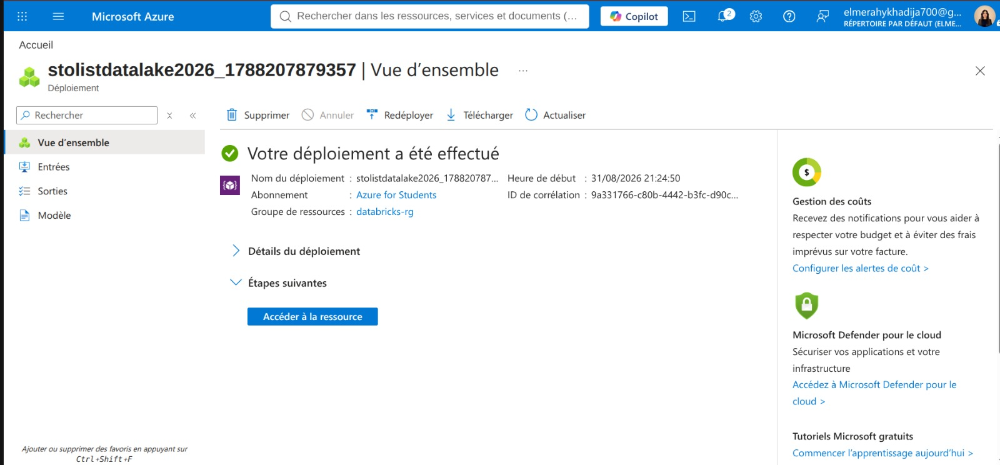
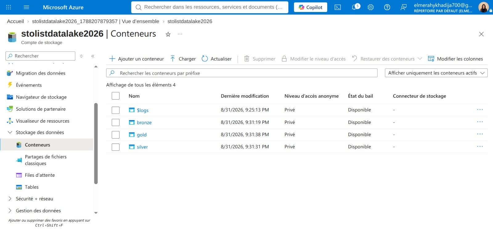
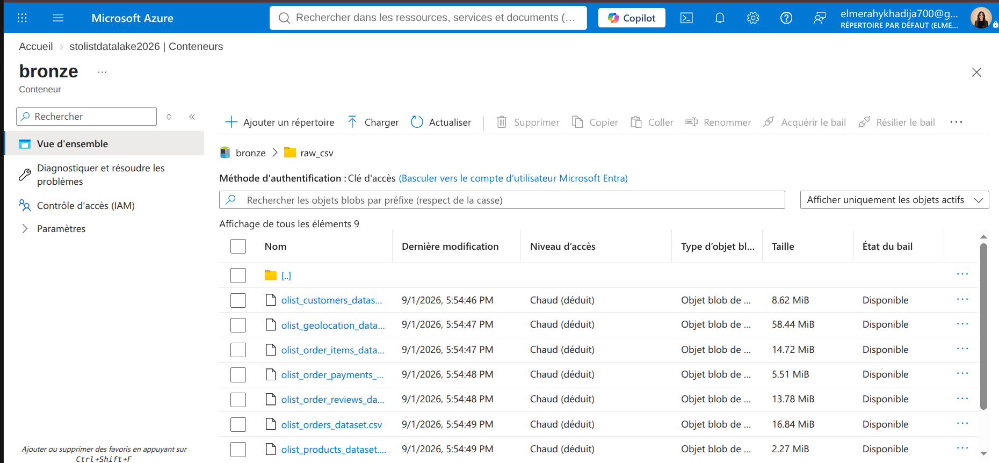
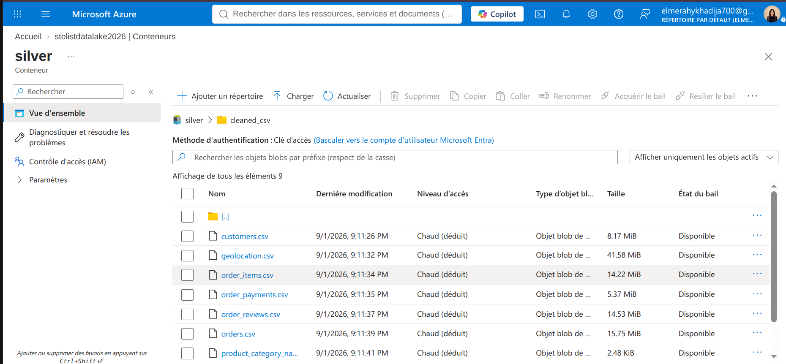
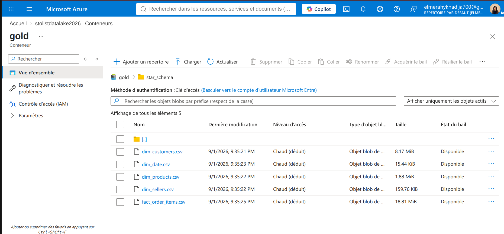
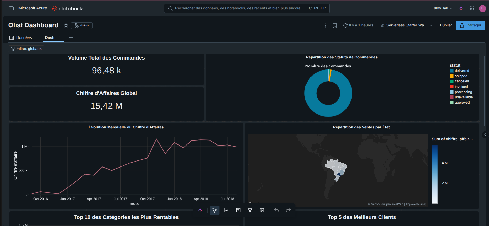
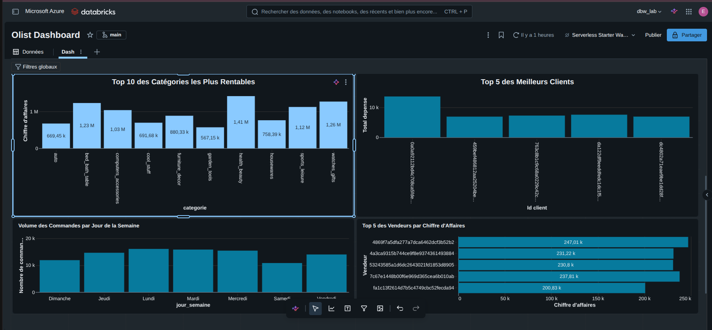

# 🚀 E-Commerce Data Pipeline & Analytics (v2) - Azure Databricks & Medallion Architecture

> 🔄 **Note sur l'évolution (Migration v2) :** Ce projet représente la **Version 2 (v2)** et constitue une migration majeure par rapport à mon pipeline initial disponible sur GitHub : [E-Commerce-Data-Pipeline (v1)](https://github.com/elmerahykhadija/E-Commerce-Data-Pipeline). 
> 
> **Périmètre de cette v2 :** Cette version se concentre exclusivement sur l'ingestion, la transformation et la valorisation analytique (**Data Analytics & Dashboard BI**), sans intégrer de composants de Machine Learning. Elle documente la migration vers le cloud **Microsoft Azure**, l'industrialisation via l'architecture **Medallion**, l'automatisation des flux par **Databricks Workflows**, et la restitution sous forme de **Dashboard Décisionnel SQL**.

---

## 📋 Contexte et Objectif du Projet

Le projet consiste à concevoir et automatiser un **pipeline de données end-to-end** sur le dataset public **Brazilian E-commerce (Olist)** de Kaggle. 

L'objectif principal est de migrer et moderniser le traitement des données pour offrir une plateforme analytique robuste capable de transformer les données brutes en indicateurs clés de performance (**KPIs**) exploitables pour la prise de décision.

### 🎯 Objectifs de la Migration (v2)
* **Migration Cloud & Architecture** : Passage à une architecture Lakehouse sur **Azure Data Lake Storage Gen2** et **Azure Databricks**, structurée selon les couches **Bronze, Silver et Gold**.
* **Modélisation Analytique** : Structuration de tables propres et normalisées en **schéma en étoile (Star Schema)** dans le catalogue `dbw_lab.gold`.
* **Orchestration Automatisée** : Mise en place d'un workflow séquentiel via **Databricks Jobs** pour automatiser l'exécution des notebooks de bout en bout.
* **Restitution BI (Data Analytics)** : Création d'un **Dashboard Databricks SQL** interactif dédié entièrement à l'analyse métier, commerciale et logistique.

#### 🔄 Comparaison Architecturale (v1 vs v2)

| Composant | Architecture Ancienne (v1) | Nouvelle Architecture (v2 - Azure Databricks) |
| --- | --- | --- |
| **Stockage brut & intermédiaire** | AWS S3 | Azure Data Lake Storage (ADLS) Gen2 |
| **Moteur de traitement** | PySpark | Clusters Databricks (PySpark optimisé) |
| **Data Warehouse** | Snowflake | Databricks SQL Serverless |
| **Orchestration** | Apache Airflow | Databricks Workflows |

---

## 🛠️ Stack Technique & Outils Utilisés
* **Cloud Infrastructure** : Microsoft Azure (ADLS Gen2 avec Namespace Hiérarchique, réplication LRS)
* **Sécurité & IAM** : Microsoft Entra ID (Service Principal, Client Secret, SAS Tokens)
* **Orchestration & Calcul** : Azure Databricks (Compute Serverless), Apache Spark (PySpark), Lakeflow Jobs
* **Gouvernance & Stockage** : Unity Catalog, Delta Lake
* **Versionnage & CI/CD** : Git / GitHub (`ecommerce-pipeline-v2-azure-databricks`)
* **Visualisation** : Databricks SQL Dashboards
* **Source des données** : Kaggle (`olistbr/brazilian-ecommerce`)

---

## 🏗️ Étapes de Réalisation du Pipeline (Data Engineering)

### 1. Infrastructure Cloud & Sécurité (Azure & Entra ID)
* Configuration du stockage **ADLS Gen2** avec l'activation du *Hierarchical Namespace* pour optimiser les performances analytiques.

  

* Sécurisation des accès via **Microsoft Entra ID** (Service Principal, Client Secret) et attribution des rôles IAM (*Contributeur aux données en blob du stockage*) pour permettre à Databricks d'interagir en toute sécurité via des jetons SAS.

  

### 2. Ingestion et Transformation (Architecture Medallion)
* **Couche Bronze** : Ingestion brute et traçable des fichiers CSV d'Olist dans le Data Lake (`bronze/raw_csv/`).

  

* **Couche Silver** : Nettoyage des valeurs manquantes, suppression des doublons, typage strict et standardisation de l'ensemble des tables (`customers`, `orders`, `order_items`, `products`, `sellers`, etc.).

  

* **Couche Gold** : Modélisation analytique en **schéma en étoile** dans le catalogue `dbw_lab.gold`, comprenant :
  * Des dimensions métier (`dim_customers`, `dim_sellers`, `dim_products`, `dim_date`).
  * Une table de faits centrale (`fact_order_items`) consolidée.

  

### 3. Orchestration du Pipeline (Databricks Workflows)
* Mise en place d'un job d'orchestration (`Olist_End_to_End_Pipeline`) versionné via le fichier de configuration YAML sur GitHub.
* Automatisation de l'enchaînement séquentiel garantissant l'intégrité des flux :
  1. `Ingestion_Bronze` (Notebook 01)
  2. `Transformation_Silver` (Notebook 02)
  3. `Modelisation_Gold` (Notebook 03)

---

## 📊 Dashboard Analytique & Interprétation des Résultats (Data Analytics)

Le dashboard décisionnel (**Olist Dashboard**) développé sous Databricks SQL exploite directement les tables de la couche Gold pour offrir une vision multidimensionnelle de l'activité e-commerce :

### 1. Indicateurs Clés de Performance (KPIs Globaux)
* **Volume Total des Commandes** : ~96,48 k commandes enregistrées.
* **Chiffre d'Affaires Global** : ~15,42 M R$ générés.
* *Interprétation* : Fournit une vue macro instantanée de la volumétrie d'activité et de la santé financière de la plateforme.

### 2. Évolution Mensuelle du Chiffre d'Affaires
* **Type de graphique** : Courbe temporelle (*Line*).
* *Interprétation* : Met en évidence une croissance soutenue de l'activité avec des pics de revenus marqués en fin d'année 2017, illustrant la saisonnalité e-commerce (périodes de fêtes / Black Friday).

### 3. Répartition des Statuts de Commandes
* **Type de graphique** : Graphique en anneau (*Donut*).
* *Interprétation* : La grande majorité des commandes possèdent le statut `delivered` (livrées avec succès), tandis que les volumes d'annulations (`canceled`) restent très marginaux, témoignant d'une bonne maîtrise opérationnelle.

### 4. Répartition Géographique des Ventes par État
* **Type de graphique** : Carte choroplèthe du Brésil (*Map*).
* *Interprétation* : Démontre une forte concentration du chiffre d'affaires et de la base clients dans la région Sud-Est du pays, notamment autour de l'État de São Paulo (SP).

### 5. Top 10 des Catégories les Plus Rentables
* **Type de graphique** : Histogramme en barres verticales (*Bar*).
* *Interprétation* : Des segments comme *health_beauty*, *watches_gifts* et *bed_bath_table* surperforment, orientant directement les choix stratégiques marketing et catalogue.

### 6. Volume des Commandes par Jour de la Semaine
* **Type de graphique** : Histogramme en barres (*Bar*).
* *Interprétation* : Affiche une constance des achats en semaine avec un léger ralentissement le week-end, renseignant sur les habitudes de navigation des acheteurs.

### 7. Top 5 des Meilleurs Clients & Top 5 des Vendeurs
* **Type de graphiques** : Barres horizontales (*Bar*).
* *Interprétation* : Permet d'identifier rapidement les partenaires e-commerce les plus contributifs et les clients à plus forte valeur (top spenders) pour structurer des actions de fidélisation ciblées.

---